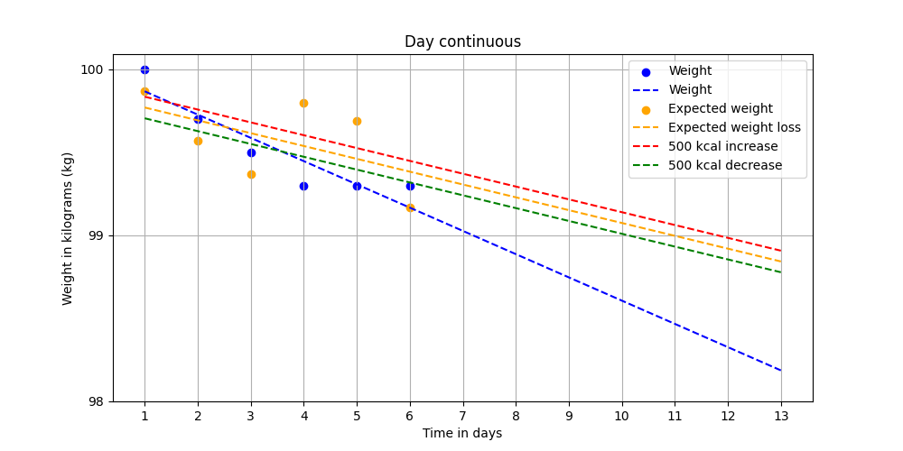

# Fat burning

## Introduction

The purpose of tracking fat burning is to adjust `calorie intake` and `active calories` based on wellbeing relative to potential weightloss.
This repository serves as a real-world example of how to track and predict visceral fat burning, using these measurements:

- `Weight` in kilograms (kg).
- `Calorie intake` in kilocalories (kcal).
- `Active calories` burned through physical activity in kilocalories (kcal).
- `Active minutes` spent on physical activity.

## How to use

Here is how to use this repository:

1. Track measurements in `/input/tracking.csv`.
2. Execute `/src/run.sh`.
3. View graphs in `/output/`.

## Methodology

The fat burning prediction is `weight` relative to `calorie expenditure` plotted against `time`. The implication is that a `surplus calorie expenditure` results in a negative prediction line (fat burning) while a `deficit calorie expenditure` results in a positive prediction line (fat gain).

`Basal Metabolic Rate` (BMR) defined as:

| Sex    | Equation                                                                           |
| :----- | :--------------------------------------------------------------------------------- |
| Male   | 88.362 + (13.397 × weight in kg) + (4.799 × height in cm) − (5.677 × age in years) |
| Female | 447.593 + (9.247 × weight in kg) + (3.098 × height in cm) − (4.330 × age in years) |

*Table: Basal Metabolic Rate equations.*

## Example

This is an example of the expected input measurements and expected output prediction.

### Input

| Sex  | Age | Height | Weight | Intake calories | Active calories | Active minutes |
| :--- | :-- | :----- | :----- | :-------------- | :-------------- | :------------- |
| Male | 26  | 186    | 100    | 2000            | 1000            | 100            |
| Male | 26  | 186    | 99.7   | 2000            | 1000            | 100            |
| Male | 26  | 186    | 99.5   | 2000            | 1000            | 100            |
| Male | 26  | 186    | 99.3   | 6000            | 0               | 0              |
| Male | 26  | 186    | 99.3   | 6000            | 1000            | 100            |
| Male | 26  | 186    | 99.3   | 2000            | 1000            | 100            |

*Table: Example of measurements.*

### Output

*Figure: Example graph of continuous fat burning prediction.*